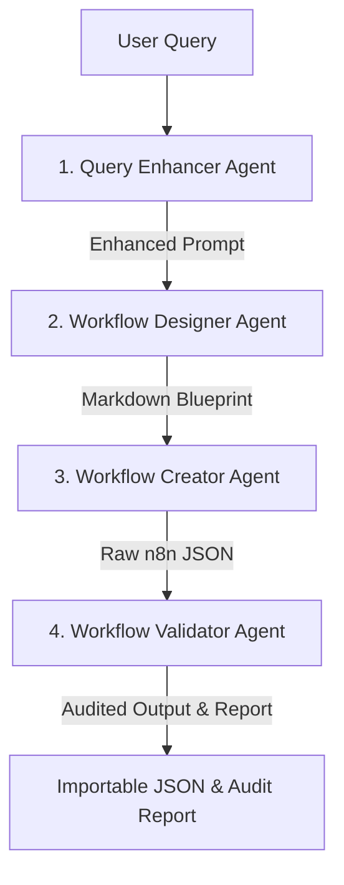

# N8N Workflow Generation Agent

An advanced, multi-agent workspace built on top of the **Agno** framework and **AgentOS**. This repository houses a fully automated pipeline that **generates complete, importable n8n workflows** directly from natural language user queries. It refines the initial prompt, designs the sequence of nodes and code steps, builds the valid **n8n JSON schema**, and audits the final output for security and runtime readiness.

---

## Architecture Overview

The project uses a structured, sequential multi-agent workflow orchestrated by **AgentOS** and stored persistently in **PostgreSQL**. The pipeline executes in four sequential stages:



1. **Query Enhancer (`QueryEnhancer`)**: Refines and expands the user's initial prompt, identifying missing logic, boundary conditions, and integrations.
2. **Workflow Designer (`WorkflowDesigner`)**: Produces a step-by-step markdown blueprint of the workflow, drafting any required JavaScript or Python code snippets.
3. **Workflow Creator (`WorkflowCreator`)**: Compiles the markdown blueprint into a valid, importable n8n JSON configuration.
4. **Workflow Validator (`WorkflowValidator`)**: Evaluates the JSON structure for syntax correctness, logical issues, security vulnerabilities (e.g., hardcoded secrets), and rate-limit risks, returning a detailed audit report.

---

## Repository Structure

```text
├── .agents/                    # Internal agent configuration files
├── agents/                     # Specialized agent modules
│   ├── __init__.py             # Agent initialization helpers
│   ├── query_enhancer.py       # Enhances raw user prompts
│   ├── workflow_designer.py    # Designs n8n workflow blueprints
│   ├── workflow_creator.py     # Generates standard n8n JSON schemas
│   └── workflow_validator.py   # Validates correctness, security, and schema compliance
├── db/                         # Database connection and session management
│   ├── __init__.py
│   ├── session.py              # PostgreSQL database persistence sessions
│   └── url.py                  # Database connection URL builder
├── docker/                     # Docker configuration and init scripts
│   └── postgres/
│       └── initdb.d/
│           └── 01-create-n8n-db.sh # Autocreates n8n databases on startup
├── models/                     # Multi-provider LLM factory loaders
│   ├── __init__.py             # Unified model loader (OpenRouter, Google, OpenAI, Anthropic)
│   ├── anthropic.py
│   ├── google.py
│   ├── openai.py
│   └── openrouter.py
├── prompts/                    # System instructions for agents
│   └── agent_instructions.py   # Large-scale specialized agent guidelines
├── skills/                     # Local knowledge and toolsets for agents
│   ├── workflow_creation_skills/
│   ├── workflow_design_skills/
│   ├── workflow_mcp_skills/
│   └── workflow_validation_skills/
├── workflow/                   # Core orchestrator module
│   └── workflow.py             # Orchestrates the sequential pipeline
├── config.yaml                 # Available model selection declarations
├── docker-compose.yml          # Container configuration for app, n8n, and Postgres db
├── Dockerfile                  # Application deployment blueprint
├── main.py                     # AgentOS core application server entrypoint
├── pyproject.toml              # Project dependencies and workspace definition
└── uv.lock                     # UV lockfile
```

---

## Core Components

### 1. AgentOS Core Backend (`main.py`)
Responsible for loading the workflow and configuration. It provides a FastAPI application wrapper around the Agno `AgentOS` workspace.
- **Workflow Storage**: Saves execution logs, session memory, and runtime steps directly to the PostgreSQL database.
- **MCP Lifecycle Hooks**: Manages connection lifespans and background connections seamlessly.

### 2. Multi-Agent Ecosystem (`agents/` & `prompts/`)
Each agent is configured with specialized instructions and tools (skills) matching its exact role:
*   **Query Enhancer**: Enhances raw queries.
*   **Workflow Designer**: Loaded with `skills/workflow_design_skills` to determine optimal integration structure, node versions, and custom code modules.
*   **Workflow Creator**: Loaded with `skills/workflow_creation_skills` to translate markdown design, outputting pure JSON with exact coordinates, input-output mappings, and variables in the double-curly `{{ $json.field }}` syntax.
*   **Workflow Validator**: Loaded with `skills/workflow_validation_skills` to catalog blockers, warning items, and security vulnerabilities.

### 3. Unified Model Loader (`models/`)
Integrates the LLM factory engine, pulling config dynamically from environment variables or `config.yaml`. Supported engines include:
- **OpenRouter** (Default: Nemotron Reasoning models)
- **Google Gemini** (Gemini 2.5 Flash)
- **OpenAI** (GPT-4o)
- **Anthropic** (Claude 3.5 Sonnet)

### 4. Database Setup & persistence (`db/`)
Utilizes a shared **PostgreSQL** database service that holds AgentOS session records, workflow trace paths, and serves as the persistence engine for the connected n8n instance.

---

## Getting Started

### Prerequisites
- [Docker](https://www.docker.com/) and Docker Compose installed.
- Valid API keys for your preferred LLM provider (e.g. OpenRouter, Google Gemini, OpenAI, or Anthropic).

### Configuration
1. Copy the sample environment file:
   ```bash
   cp .env.example .env
   ```
2. Open the `.env` file and insert your API keys:
   ```env
   # Example for Google Gemini
   MODEL_PROVIDER=google
   GOOGLE_API_KEY=your_gemini_api_key_here

   # Example for OpenRouter
   MODEL_PROVIDER=openrouter
   OPENROUTER_API_KEY=your_openrouter_api_key_here
   ```

### Running with Docker Compose
To start the entire environment (AgentOS service, n8n instance, and PostgreSQL database) in containers:

```bash
docker compose up --build -d
```

Once running, the following services are available:
*   **AgentOS Backend**: `http://localhost:8000` (FastAPI Swagger interface available at `http://localhost:8000/docs`)
*   **n8n Console**: `http://localhost:5678` (Sign up or log in to manage, run, and import generated workflows)
*   **PostgreSQL Database**: `localhost:5432` (Contains `workflow_agent` and `n8n` schemas)

---

## Local Development

If you prefer to run the application locally outside of containers:

### 1. Install Dependencies
Using [uv](https://github.com/astral-sh/uv) (recommended):
```bash
uv sync
```

### 2. Configure Database & Environment
Make sure a local PostgreSQL database is running, and match the variables in your `.env` to point to it (e.g. `DB_HOST=127.0.0.1`).

### 3. Run the Development Server
```bash
python main.py
```
Or run directly via `uvicorn`:
```bash
uvicorn main:app --reload --port 8000
```
